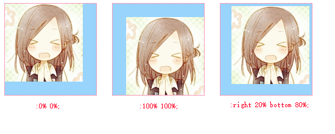

`width, height`参照***包含块(Containing Block)***

`padding,margin`参照包含块(Containing Block)的***宽度***

`boder-radius`参照***元素本身***

`background-position`参照***由放置背景图的区域尺寸，减去背景图的尺寸得到***可以为负值

`line-height`参照***自身的`font-size`***

`vertical-align`参照***自身的`line-height`***

`bottom,left`参照***包含块的宽度***

`right,top`参照***包含块的高度***

`transform: translate()`参照***自身边界框的尺寸***

#### 参考：

[**EdwardUp**:详述css中的百分比值](https://segmentfault.com/a/1190000000590998)
