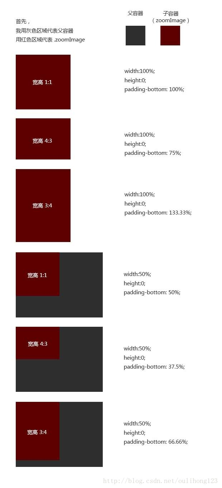

# 原理剖析

```
width:100%;
height:0;
padding-bottom: 100%;
overflow:hidden;
```


样式中的上面四句主要目的是为了让这个div以1：1的大小呈现，虽然height：0；高度为0，但是它的padding值为100%， 这是因为在padding为百分比的时候，是根据他父层的宽度来进行计算的。 这一点MDN关于padding的文档也有说到。

```
background-position: center center;
background-repeat: no-repeat;
-webkit-background-size:cover;
-moz-background-size:cover;
background-size:cover;
```

后面5句就是利用了css3中的 background-size:cover 的特性，把背景图像扩展至足够大，以使背景图像完全覆盖背景区域。


**总结：就是你所需要的比例，就是width与padding-bottom的比例** 
用的时候，直接把.zoomImage当成img标签来用就可以了。

